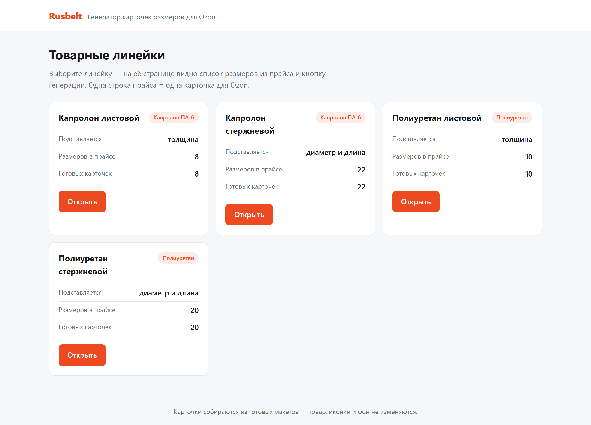
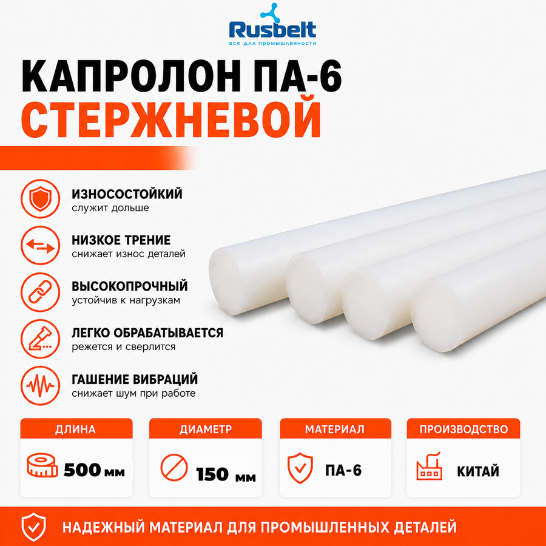
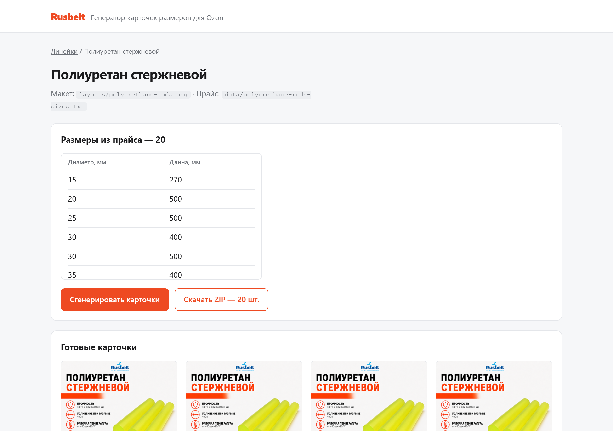
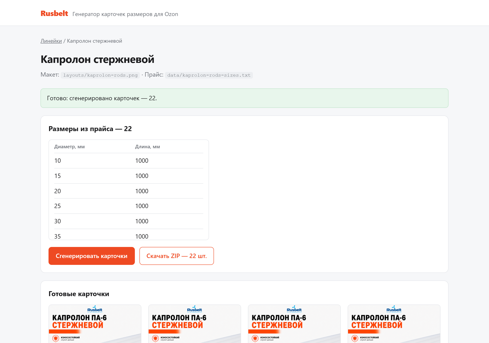
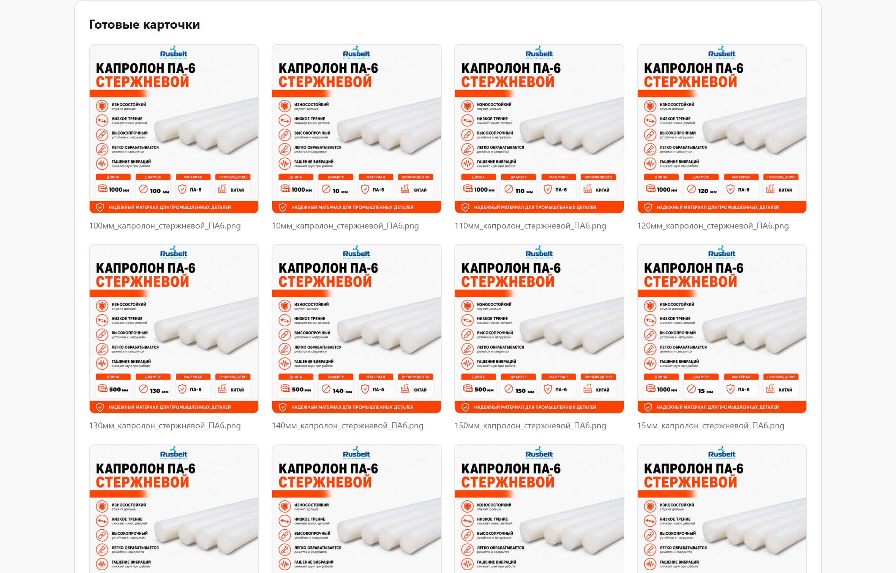

# Генератор карточек размеров для Ozon

Автоматическая подготовка карточек-инфографик для маркетплейса: скрипт берёт готовый макет от дизайнера и прайс-лист с размерами, после чего сам подставляет нужные числа в нужные места изображения. Товар, иконки, стрелки, логотип и фон остаются нетронутыми — меняются только цифры.



## Проблема

Для каждого типоразмера промышленного материала на Ozon нужна своя карточка. Отличается на ней ровно одно — число: толщина листа, диаметр или длина стержня. Всё остальное одинаковое.

Раньше это делалось вручную в графическом редакторе: открыть макет, найти текстовый слой, заменить число, проверить, что оно не съехало и не вылезло за плашку, экспортировать PNG, назвать файл. И так десятки раз на каждую линейку. Работа монотонная, занимает часы и порождает ошибки: где-то остаётся старое значение, где-то цифра встаёт не по базовой линии.

При этом прайс-лист живёт своей жизнью: меняются длины, появляются новые диаметры, уходят старые позиции. Каждое такое изменение означает новый заход в редактор.

## Пользователь

- **Менеджер маркетплейсов** — основной пользователь: загружает готовые карточки в Ozon.
- **Контент-менеджер** — обновляет карточки при изменении прайса.
- **Дизайнер** — делает макет один раз, дальше не участвует в рутине.

Проект рассчитан на компанию, которая продаёт линейки однотипных товаров, различающихся только размером: промышленные материалы, метизы, трубы, профили.

## Основная функция

**На входе:**

- PNG-макет линейки (`layouts/`) — чистая карточка от дизайнера;
- прайс-лист с размерами (`data/`) — выгрузка из Excel в TSV или файл `.xlsx`;
- шрифт Montserrat Black (`fonts/`).

**Что происходит:**

1. Скрипт читает прайс и отбрасывает единицы измерения из ячеек — «10 мм» превращается в `10`.
2. Для каждой строки прайса открывает макет и заливает область с размером точным цветом фона плашки.
3. Бинарным поиском подбирает кегль шрифта так, чтобы высота цифр совпала с макетом: «5» и «1000» получаются одной высоты.
4. Печатает число по базовой линии и рядом, меньшим кеглем, единицу измерения.
5. Сохраняет PNG в исходном разрешении 1254×1254.

**На выходе:** папка `output/<линейка>/` с готовыми PNG — по одному файлу на каждую строку прайса.

## Формат результата

Файлы называются по размерам, чтобы их можно было сразу сопоставить с карточками товара на Ozon:

```
output/kaprolon-rods/
├── 10мм_капролон_стержневой_ПА6.png
├── 15мм_капролон_стержневой_ПА6.png
├── 150мм_капролон_стержневой_ПА6.png
└── ...
```

Через веб-интерфейс всю линейку можно скачать одним ZIP-архивом.



## Минимальный функционал (MVP)

Реализовано:

- [x] Веб-интерфейс: выбор линейки, просмотр размеров из прайса, генерация в один клик
- [x] Превью готовых карточек прямо в браузере
- [x] Выгрузка всей линейки одним ZIP-архивом
- [x] Четыре товарные линейки: капролон листовой и стержневой, полиуретан листовой и стержневой
- [x] Автоподбор кегля под высоту макета
- [x] Запуск из командной строки для пакетной генерации
- [x] Тестовый режим `--only-first` — одна карточка для проверки перед полным прогоном

Планы на следующие версии:

- [ ] Загрузка макета и прайса через интерфейс, без правки файлов на диске
- [ ] Автоподгонка кегля, если число не помещается в плашку
- [ ] Визуальный редактор координат вместо констант в коде
- [ ] Новые товарные линейки по мере появления макетов

## Технологии

| Что | Зачем |
|---|---|
| Python 3.11 | основной язык |
| Pillow 12 | работа с изображениями: заливка области, отрисовка текста, замеры |
| Flask 3 + Jinja2 | веб-интерфейс |
| openpyxl 3.1 | чтение прайса в формате `.xlsx` |
| argparse | параметры командной строки |
| Montserrat Black | шрифт карточек (лицензия SIL OFL) |

Внешние сервисы и API не используются — всё работает локально.

## Установка и запуск

```powershell
git clone https://github.com/andrey-yagnatovskiy/ozon-size-cards.git
cd ozon-size-cards
pip install -r requirements.txt
python app.py
```

Открыть <http://127.0.0.1:5000>.

### Как пользоваться

1. На главной выбрать товарную линейку.
2. Проверить список размеров — он подтягивается из прайса в `data/`.
3. Нажать «Сгенерировать карточки».
4. Посмотреть превью и скачать ZIP.







### Запуск без интерфейса

Каждую линейку можно прогнать из командной строки:

```powershell
python generate_kaprolon_sterzhni.py
python generate_kaprolon_listy.py
python generate_poliuretan_sterzhen.py
python generate_poliuretan_list.py
```

Доступные параметры: `--template`, `--data`, `--output-dir`, `--only-first`.

## Структура проекта

```
├── app.py                          # веб-интерфейс Flask
├── generate_cards.py               # общие функции отрисовки, используются всеми линейками
├── generate_kaprolon_listy.py      # капролон листовой
├── generate_kaprolon_sterzhni.py   # капролон стержневой
├── generate_poliuretan_list.py     # полиуретан листовой
├── generate_poliuretan_sterzhen.py # полиуретан стержневой
├── layouts/                        # PNG-макеты линеек
├── data/                           # прайсы с размерами
├── fonts/                          # Montserrat Black + лицензия OFL
├── assets/                         # логотип Rusbelt
├── templates/                      # HTML-шаблоны Flask
├── static/                         # стили интерфейса
├── screenshots/                    # скриншоты для README
├── output/                         # результат генерации (не хранится в репозитории)
└── .claude/skills/                 # скилл проекта для Claude Code
```

## Как добавить новую товарную линейку

1. Положить макет в `layouts/` и прайс в `data/`.
2. Скопировать один из скриптов `generate_*.py` и поправить константы: пути и координаты блоков с размерами.
3. Добавить линейку в список `LINES` в `app.py`.

Координаты блока подбираются по макету: прямоугольник заливки, левый край цифр, базовая линия, высота цифр и единицы измерения, отступ между ними.

## Скилл для Claude Code

В репозитории лежит скилл `.claude/skills/generate-ozon-size-cards/SKILL.md`. Он объясняет Claude Code структуру проекта, порядок генерации, правила работы с макетами и типовые ошибки — коллега может развернуть проект у себя и сразу начать работать.

## Ограничения

- Координаты блоков с размерами заданы константами под конкретные макеты. Новый макет требует подбора координат.
- Если число не помещается в плашку — например четырёхзначное значение в узком блоке — кегль не уменьшается автоматически.

## Лицензия

Шрифт Montserrat распространяется по лицензии SIL Open Font License 1.1 — текст в `fonts/OFL.txt`. Макеты карточек и логотип принадлежат компании «Русбелт».
